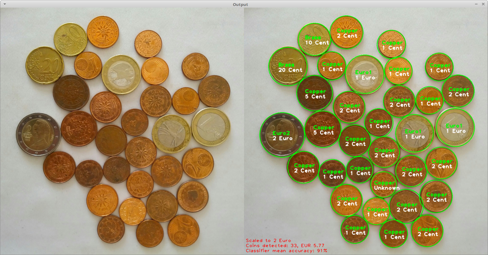

# coin_detector
Detect and count coins in an image




This is just a proof of concept. The source code is heavily commented, so there is no need for any further explanations here.

# Setup
```
# Install dependencies
sudo apt-get update
sudo apt-get upgrade
sudo apt-get install build-essential cmake pkg-config
sudo apt-get install libjpeg8-dev libtiff5-dev libjasper-dev libpng12-dev
sudo apt-get install libavcodec-dev libavformat-dev libswscale-dev libv4l-dev
sudo apt-get install libxvidcore-dev libx264-dev libgtk-3-dev
sudo apt-get install libatlas-base-dev gfortran python3.5-dev

# Download OpenCV source and contrib repository
cd ~
wget -O opencv.zip https://github.com/Itseez/opencv/archive/3.2.0.zip
wget -O opencv_contrib.zip https://github.com/Itseez/opencv_contrib/archive/3.2.0.zip
unzip opencv_contrib.zip
unzip opencv.zip

# Setup Python virtual environment
sudo pip install virtualenv virtualenvwrapper
sudo rm -rf ~/get-pip.py ~/.cache/pip

# Update and reload .bashrc
echo "export WORKON_HOME=$HOME/.virtualenvs" >> ~/.bashrc
echo "source /usr/local/bin/virtualenvwrapper.sh" >> ~/.bashrc
source ~/.bashrc

# Create virtual environment
mkvirtualenv cv -p python3

# Install additional modules
workon cv
pip install numpy sklearn scipy matplotlib

# Compile and install OpenCV
cd ~/opencv-3.2.0/
mkdir build
cd build
cmake -D CMAKE_BUILD_TYPE=RELEASE \
-D CMAKE_INSTALL_PREFIX=/usr/local \
-D INSTALL_PYTHON_EXAMPLES=ON \
-D INSTALL_C_EXAMPLES=OFF \
-D OPENCV_EXTRA_MODULES_PATH=~/opencv_contrib-3.2.0/modules \
-D PYTHON_EXECUTABLE=~/.virtualenvs/cv/bin/python \
-D BUILD_EXAMPLES=ON ..

# Build with 4 processes
make -j4

# Install OpenCV
sudo make install
ldconfig

# Rename and symlink Python bindings
cd /usr/local/lib/python3.5/site-packages/
sudo mv cv2.cpython-35m-x86_64-linux-gnu.so cv2.so
cd ~/.virtualenvs/cv/lib/python3.5/site-packages/
ln -s /usr/local/lib/python3.5/site-packages/cv2.so cv2.so

# Testing installation: should print '3.2.0'
workon cv
python -c "import cv2; print(cv2.__version__)"

# Cleanup (only if previous step was successful!)
cd ~
rm -rf opencv-3.2.0 opencv_contrib-3.2.0 opencv.zip opencv_contrib.zip
```

# Usage
```
workon cv
python detect_coins.py -i input.jpg
```